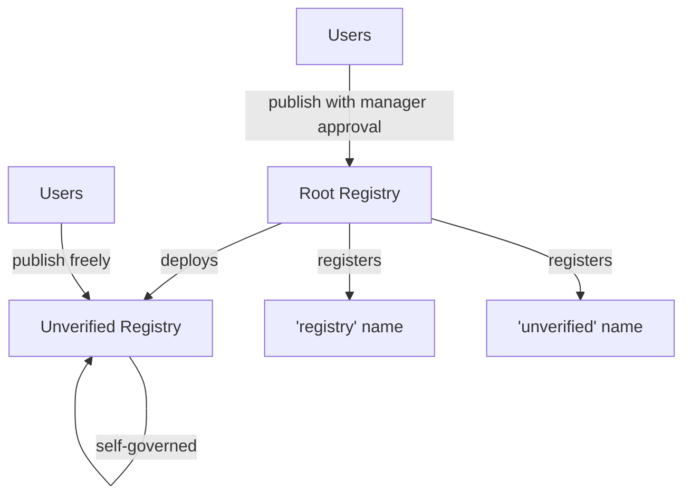
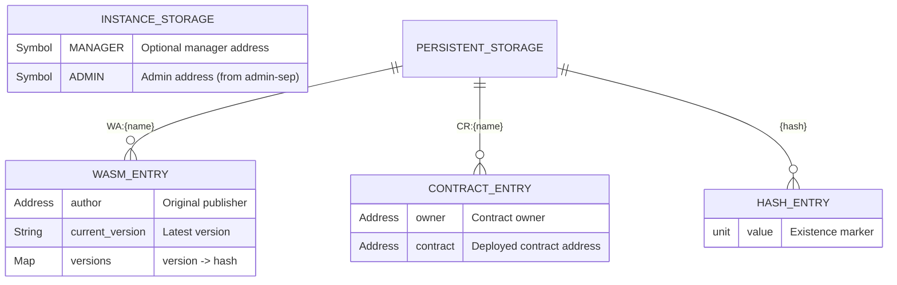
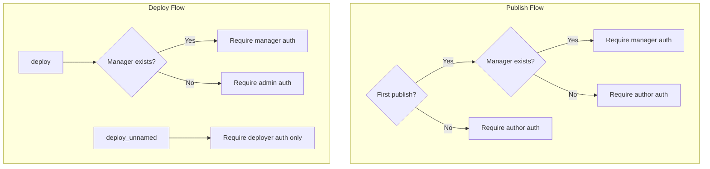
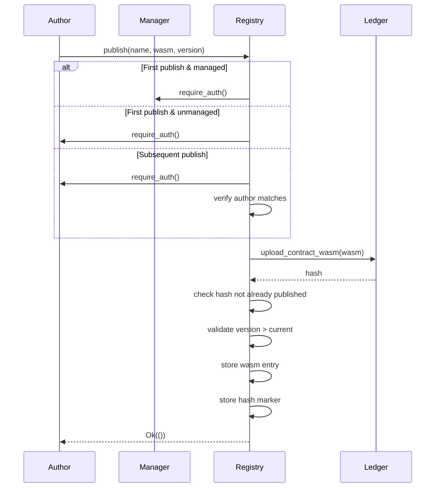
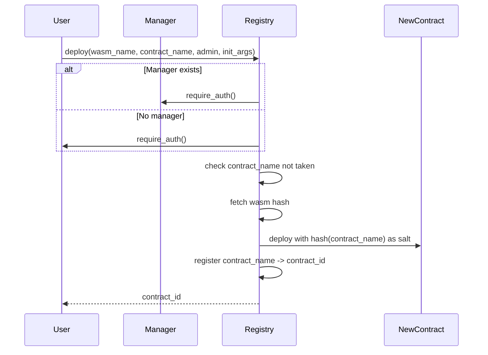
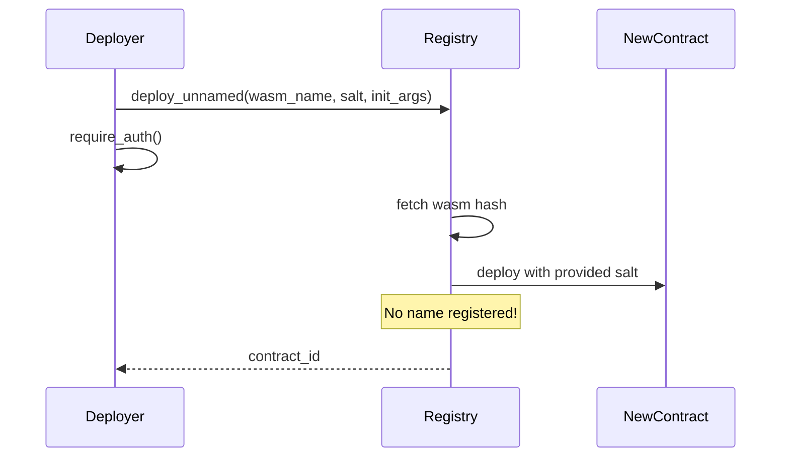
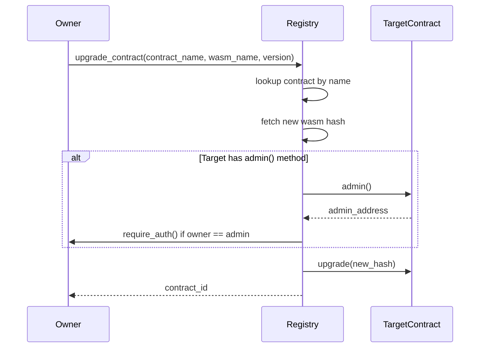
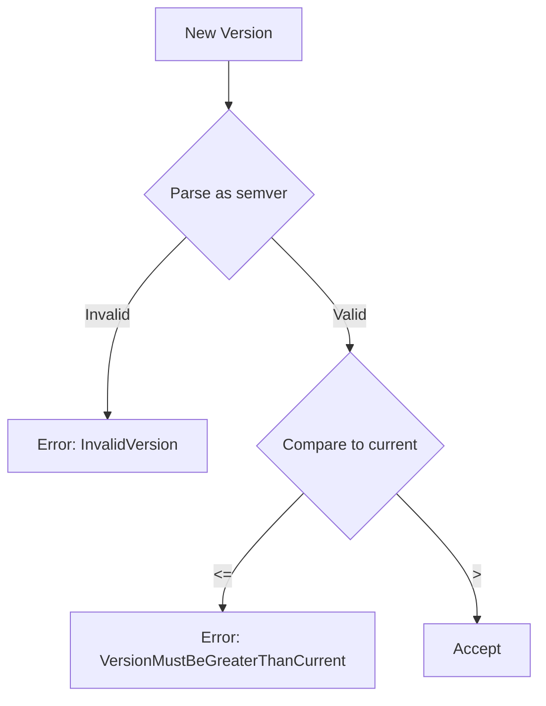
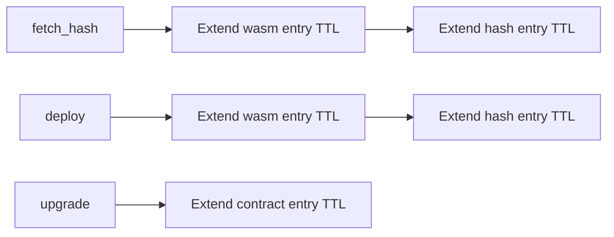

# Registry Contract Architecture

This document describes the architecture and design decisions of the Stellar Registry contract.

## Overview

The Registry contract is an on-chain package manager for Soroban smart contracts. It provides:

1. **Wasm Publishing** - Store contract bytecode with semantic versioning
2. **Contract Deployment** - Deploy contracts from published wasm with optional name registration
3. **Name Resolution** - Look up deployed contracts by human-readable names
4. **Upgrade Management** - Upgrade deployed contracts to new versions

## Contract Hierarchy



The root registry is a **managed** registry that requires manager approval for initial publishes. It automatically deploys an **unverified** registry where anyone can publish without approval.

## Storage Architecture



### Storage Keys

| Prefix | Type | Purpose |
|--------|------|---------|
| `WA:{name}` | Persistent | Published wasm metadata |
| `CR:{name}` | Persistent | Deployed contract registry |
| `{hash}` | Persistent | Hash existence check (prevents duplicate publishes) |
| `MANAGER` | Instance | Manager address for approval workflow |

## Authorization Model



### Key Authorization Rules

| Operation | Managed Registry | Unmanaged Registry |
|-----------|------------------|-------------------|
| Initial publish | Manager auth | Author auth |
| Subsequent publish | Author auth | Author auth |
| `deploy` | Manager auth | Admin auth |
| `deploy_unnamed` | Deployer auth | Deployer auth |
| `register_contract` | Manager auth | Owner auth |

## Core Operations

### Publishing



### Deployment Options

The registry provides two deployment methods with different use cases:

#### `deploy` - Named Deployment



**Use case**: When you want a human-readable name registered in the registry for discovery.

#### `deploy_unnamed` - Anonymous Deployment



**Use case**: When you just need to deploy a contract without registering a name.

**Why no manager auth?** The `deploy_unnamed` function intentionally skips manager authorization because:

1. **No name reservation**: It doesn't claim a name in the registry, so there's no namespace to protect
2. **Public wasm**: The wasm hash is already public - anyone can look it up and deploy it themselves using `env.deployer()`
3. **Deployer control**: The deployer provides their own salt and receives the contract, taking full responsibility
4. **Permissionless by design**: This enables use cases where users deploy their own instances of published contracts (e.g., token factories, personal vaults)

### Upgrade Flow



## Name Normalization

Names are normalized to a canonical form before storage:

```mermaid
flowchart LR
    A[Input: "Hello_World"] --> B[Lowercase]
    B --> C["hello_world"]
    C --> D[Replace _ with -]
    D --> E["hello-world"]
    E --> F{Valid?}
    F -->|Yes| G[Store]
    F -->|No| H[Error]
```

### Validation Rules

1. Length: 1-64 characters
2. First character: ASCII alphabetic
3. Remaining: ASCII alphanumeric, `-`, or `_`
4. Not a Rust keyword (after normalization)

### Equivalent Names

These all resolve to the same canonical name `hello-world`:
- `hello_world`
- `hello-world`
- `Hello_World`
- `HELLO-WORLD`

## Version Management

Versions follow [Semantic Versioning](https://semver.org/):



### Ordering Examples

| Current | New | Result |
|---------|-----|--------|
| 1.0.0 | 1.0.1 | Accepted |
| 1.0.0 | 2.0.0-alpha | Accepted |
| 1.0.0 | 1.0.0 | Rejected |
| 1.0.1-alpha | 1.0.1 | Accepted |
| 1.0.1 | 1.0.1-beta | Rejected |

## TTL Management

The registry extends TTL for accessed entries:



Maximum TTL extension: **535,679 ledgers** (~31 days at 5s/ledger)

## Security Considerations

### Hash Uniqueness

Each wasm hash can only be published once across all names. This prevents:
- Hash squatting (publishing someone else's wasm under a different name)
- Confusion about which name is "official"

### Manager Trust Model

When a manager is set:
- Manager approves initial publishes (namespace control)
- Manager approves named deployments (prevents name squatting)
- Authors retain control of subsequent versions

### Contract Registration

`register_contract` allows registering externally-deployed contracts. The registry trusts that:
- On managed registries: Manager has verified the owner's claim
- On unmanaged registries: Owner self-attests (first-come-first-served)

## Public Interface

### Read Operations

| Method | Description |
|--------|-------------|
| `fetch_hash(name, version?)` | Get wasm hash for a published name |
| `current_version(name)` | Get latest version of published wasm |
| `fetch_contract_id(name)` | Get contract address by name |
| `fetch_contract_owner(name)` | Get owner of registered contract |
| `manager()` | Get current manager address |
| `admin()` | Get current admin address |

### Write Operations

| Method | Description |
|--------|-------------|
| `publish(name, author, wasm, version)` | Upload and register wasm |
| `publish_hash(name, author, hash, version)` | Register pre-uploaded wasm |
| `deploy(wasm_name, version?, contract_name, admin, init?, deployer?)` | Deploy and register |
| `deploy_unnamed(wasm_name, version?, init?, salt, deployer)` | Deploy without registration |
| `register_contract(name, address, owner)` | Register existing contract |
| `upgrade_contract(name, wasm_name, version?, fn?)` | Upgrade via registry |
| `dev_deploy(name, wasm, fn?)` | Upload and upgrade in one call |

### Admin Operations

| Method | Description |
|--------|-------------|
| `set_admin(new_admin)` | Transfer admin role |
| `set_manager(new_manager)` | Set new manager |
| `remove_manager()` | Remove manager (becomes unmanaged) |
| `upgrade(hash)` | Upgrade registry itself |
